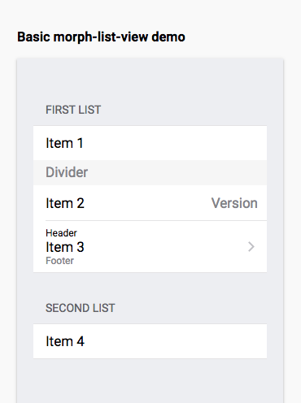
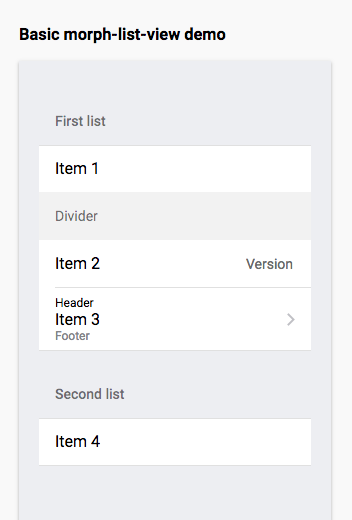
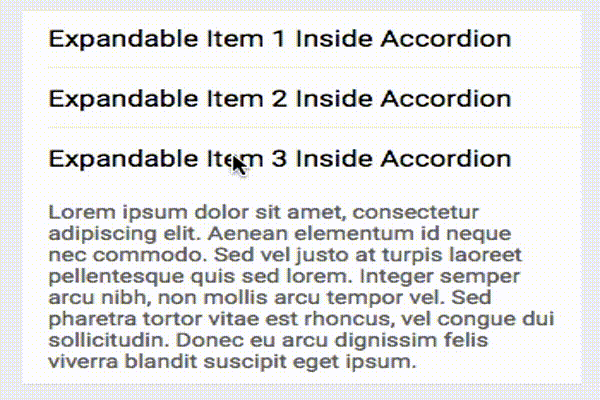

# morph-list-view

[](https://opensource.org/licenses/Apache-2.0) [](https://www.webcomponents.org/element/PolymerElements/paper-progress)

List view container component

`morph-list-view` is the containing parent element for other list view components like `morph-list-view-item`, `morph-list-view-title`, `morph-list-view-divider`. These list item components changes its appearance based on the whether the platform or device is IOS or Android.

## Getting Started

For the information about how to clone the desired repository, running the local server and testing, please refer to Polymorph elements getting started docs at the end of this repository.

## Demo

<!---

```
<custom-element-demo>
  <template>
    <script src="../webcomponentsjs/webcomponents-lite.js"></script>
    <link rel="import" href="../morph-list-view-item/morph-list-view-item.html">
    <link rel="import" href="../morph-list-view-title/morph-list-view-title.html">
    <link rel="import" href="../morph-list-view-divider/morph-list-view-divider.html">
    <link rel="import" href="../iron-icons/maps-icons.html">
    <link rel="import" href="morph-list-view.html">
    <style>
      html {
        background-color: #eff0f4;
      }
    </style>
    <next-code-block></next-code-block>
  </template>
</custom-element-demo>

```

-->

```html

<morph-list-view platform="android">
  <morph-list-view-title platform="android">Android List Components</morph-list-view-title>

  <morph-list-view-item platform="android">
    Android List Item
    <span slot="secondary-content">Android Version</span>
  </morph-list-view-item>

  <morph-list-view-divider platform="android">Android Divider Element</morph-list-view-divider>

  <morph-list-view-item platform="android" href="#moduware">
    <span slot="header">Header</span>
    Android list item with href comes with ripple effect by default
    <span slot="footer">Footer</span>
  </morph-list-view-item>

  <morph-list-view-item platform="android" href="#moduware" expandable>
    Expandable List Item with Link - Click to close or expand
    <span slot="secondary-content">Android Version</span>
    <span slot="expandable-content">
  Lorem ipsum dolor sit amet, consectetur adipiscing elit. Aenean elementum id neque nec commodo. Sed vel justo at turpis laoreet pellentesque quis sed lorem. Integer semper arcu nibh, non mollis arcu tempor vel. Sed pharetra tortor vitae est rhoncus, vel congue dui sollicitudin. Donec eu arcu dignissim felis viverra blandit suscipit eget ipsum.
    </span>
  </morph-list-view-item>
</morph-list-view>

<morph-list-view platform="ios">
  <morph-list-view-title platform="ios">IOS List Components</morph-list-view-title>

  <morph-list-view-item platform="ios">
    List Item with secondary-content slot
    <span slot="secondary-content">IOS Version</span>
  </morph-list-view-item>

  <morph-list-view-item platform="ios" href="#moduware">
    <span slot="header">Header</span>
    List Item with both header and footer slot
    <span slot="footer">Footer</span>
  </morph-list-view-item>

  <morph-list-view-divider platform="ios">IOS Divider Element</morph-list-view-divider>

  <morph-list-view-item platform="ios" href="#moduware" expandable>
    <span slot="icon"><iron-icon icon="maps:directions-bus"></iron-icon></span>
    Expandable List Item - Click to close or expand
    <span slot="secondary-content">IOS Version</span>
    <span slot="expandable-content">
  Lorem ipsum dolor sit amet, consectetur adipiscing elit. Aenean elementum id neque nec commodo. Sed vel justo at turpis laoreet pellentesque quis sed lorem. Integer semper arcu nibh, non mollis arcu tempor vel. Sed pharetra tortor vitae est rhoncus, vel congue dui sollicitudin. Donec eu arcu dignissim felis viverra blandit suscipit eget ipsum.
    </span>
  </morph-list-view-item>
</morph-list-view>

```

- Here is a quick demo of the morph-list-view element for IOS.

  <p align="center">
    
  </p>

```html

<template>
  <morph-list-view platform="ios">
    <morph-list-view-title>First list</morph-list-view-title>
    <morph-list-view-item>Item 1</morph-list-view-item>

    <morph-list-view-divider>Divider</morph-list-view-divider>

    <morph-list-view-item>
      Item 2
      <span slot="secondary-content">Version</span> 
    </morph-list-view-item>
    <morph-list-view-item href="#moduware">
      <span slot="header">Header</span>
      Item 3
      <span slot="footer">Footer</span>
    </morph-list-view-item>
  </morph-list-view>

  <morph-list-view>
    <morph-list-view-title>Second list</morph-list-view-title>
    <morph-list-view-item>Item 4</morph-list-view-item>
  </morph-list-view>
</template>

```

- Here is a quick demo of the morph-list-view element for Android.

  <p align="center">
    
  </p>

```html

<template>
  <morph-list-view platform="android">
    <morph-list-view-title>First list</morph-list-view-title>
    <morph-list-view-item>Item 1</morph-list-view-item>

    <morph-list-view-divider>Divider</morph-list-view-divider>

    <morph-list-view-item>
      Item 2
      <span slot="secondary-content">Version</span> 
    </morph-list-view-item>
    <morph-list-view-item href="#moduware">
      <span slot="header">Header</span>
      Item 3
      <span slot="footer">Footer</span>
    </morph-list-view-item>
  </morph-list-view>

  <morph-list-view>
    <morph-list-view-title>Second list</morph-list-view-title>
    <morph-list-view-item>Item 4</morph-list-view-item>
  </morph-list-view>
</template>

```

|     Custom Attribute    |   Type  | Description                                                                                   | Default        |
|:-----------------------:|:-------:|-----------------------------------------------------------------------------------------------|----------------|
|      **`accordion`**    | Boolean | This is an option for items to expand one at a time on the same list view                     | **`false`**    |

- Here is a quick demo of the morph-list-view element with accordion option

  <p align="center">
    
  </p>

- Sample HTML markup for accordion list

```html

<template>
  <morph-list-view accordion>
    <morph-list-view-title>Accordion list</morph-list-view-title>
    <morph-list-view-item expandable expanded>Item 1</morph-list-view-item>
    <morph-list-view-item expandable>Item 2</morph-list-view-item>
    <morph-list-view-item expandable>Item 3</morph-list-view-item>
  </morph-list-view>
</template>

```

## Further help

For more information on how to install and run test please go here - [Polymorph elements getting started]

[Polymorph elements getting started]: https://github.com/moduware/polymorph-components/blob/master/INFO.md